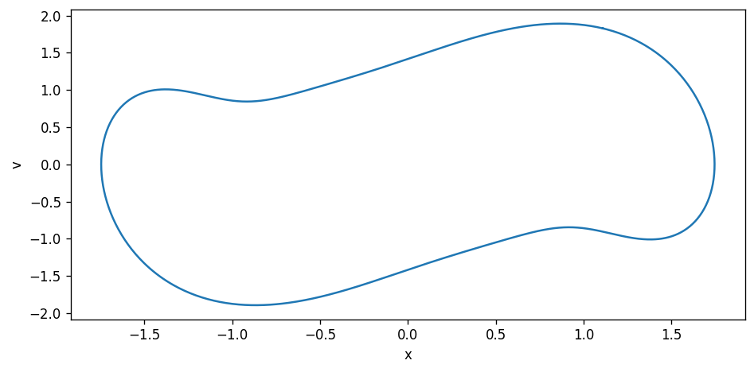

# Harmonic Balance

[](https://www.python.org/downloads/)
[](https://opensource.org/licenses/MIT)

A minimalistic, object-oriented framework for solving periodic steady states and limit cycles of nonlinear dynamic systems using the **Alternating Frequency-Time (AFT) Harmonic Balance Method**.

## Features

- 🎯 **Object-oriented design** - Natural problem formulation using the `Fourier` class
- ⚡ **Efficient computations** - Leverages NumPy's FFT for frequency-time transformations
- 🔧 **Extensive nonlinearities** - Built-in support for common nonlinear operations
- 📊 **Solution continuation** - Predictor-corrector methods for bifurcation analysis
- 🐍 **Modern Python** - Type hints, clean API, Python 3.9+ support
- 📦 **Minimal dependencies** - Only requires NumPy and SciPy

## Installation

### From PyPI (Recommended)

```console
pip install harmonicbalance
```

### From Source (Latest Development Version)

```console
git clone https://github.com/milanofthe/harmonicbalance.git
cd harmonicbalance
pip install -e .
```

### Development Installation

For development with linting and type checking tools:

```console
pip install -e ".[dev]"
```

## Core Concepts

### The Fourier Class

The `Fourier` class is the heart of this framework. It represents a periodic signal using Fourier series coefficients and implements:

- **Arithmetic operations**: Addition, subtraction, multiplication, division
- **Nonlinear operations**: Powers, trigonometric functions, exponentials, etc.
- **Differentiation**: Time-domain differentiation via `dt()` method
- **Automatic domain switching**: Seamless conversion between frequency and time domains

#### Mathematical Representation

Internally, Fourier coefficients are stored in real-valued form (DC, cosine, and sine components):

$$
x(t) = c_\mathrm{DC} + \sum_{n=1}^N a_n \cos( n \omega t ) + b_n \sin( n \omega t )
$$

This real representation (as opposed to complex phasors) enables the use of powerful optimizers from `scipy.optimize`.

#### Key Features

- **Operator overloading**: Natural mathematical syntax (`X**3`, `X.sin()`, etc.)
- **Efficient FFT**: Uses NumPy's `rfft`/`irfft` for frequency-time transformations
- **NumPy compatibility**: Integrates with NumPy's universal function (ufunc) system
- **Automatic residual construction**: Complex nonlinear problems become simple expressions

In essence, the `Fourier` class handles all the complexity of harmonic balance residual formulation and domain transformations automatically.

## Quick Start: Duffing Oscillator

Let's solve the steady-state response of the **Duffing oscillator**, a damped oscillator with cubic nonlinearity:

$$
m \ddot{x} + c \dot{x} + d x + g x^3 = p \cos(\omega_0 t)
$$

### Harmonic Balance Formulation

In harmonic balance, we seek a solution where the residual is zero:

$$
r(x) = m \ddot{x} + c \dot{x} + d x + g x^3 - p \cos(\omega_0 t) = 0
$$

### Implementation

```python
import numpy as np
import matplotlib.pyplot as plt
from harmonicbalance import Fourier, fouriersolve

# Duffing oscillator parameters
m, c, d, g, p = 1.0, 2.0, 0.3, 1.4, 5.0

# Define excitation (cosine term)
U = Fourier(omega=1, n=5)
U[1] = 1  # Set fundamental frequency cosine coefficient

# Residual function using natural mathematical syntax
def residual_duffing(X):
    return m * X.dt().dt() + c * X.dt() + d * X + g * X**3 - p * U

# Initial guess
X0 = U.copy()

# Solve the harmonic balance equations
X_sol, _sol = fouriersolve(residual_duffing, X0, method="hybr")
```

```

### Visualizing the Solution

The `Fourier` class provides direct time-domain evaluation via the `__call__` method:

```python
# Evaluate solution in time domain
t = np.linspace(0, X_sol._T(), 1000)
x = X_sol(t)

# Compute velocity via differentiation
V_sol = X_sol.dt()
v = V_sol(t)

# Plot time domain response
fig, (ax1, ax2) = plt.subplots(1, 2, figsize=(12, 4))

ax1.plot(t, x, label="x(t)")
ax1.plot(t, v, label="v(t)")
ax1.set_xlabel("Time")
ax1.set_ylabel("Response")
ax1.legend()
ax1.set_title("Time Domain Response")

# Plot phase portrait
ax2.plot(x, v)
ax2.set_xlabel("Displacement x")
ax2.set_ylabel("Velocity v")
ax2.set_title("Phase Portrait")

plt.tight_layout()
```

**Time Domain Response:**


**Phase Portrait:**


    


## Advanced: Bifurcation Analysis with Predictor-Corrector

The Duffing oscillator exhibits **bifurcations** — multiple solutions exist for the same parameters. The harmonic balance method excels at finding these solutions through **continuation methods**.

### Backbone Curves

This package includes a `PredictorCorrectorSolver` that:
- Uses the secant method for prediction
- Applies arc-length continuation with hypersphere constraints
- Traces complete solution branches (including unstable ones)

### Example: Frequency Response

```python
from harmonicbalance import Fourier, PredictorCorrectorSolver

# Duffing parameters
m, c, d, g, p = 1, 0.2, 1, 2, 3

# Excitation
U = Fourier(omega=1, n=5)
U[1] = 1  # Fundamental frequency cosine coefficient

# Residual function
def residual_duffing(X):
    return m * X.dt().dt() + c * X.dt() + d * X + g * X**3 - p * U

# Initial guess
X0 = U.copy()

# Initialize predictor-corrector solver
PCS = PredictorCorrectorSolver(
    residual_duffing,
    X0,
    alpha_start=X0.omega,
    alpha_end=5,
    alpha_step=0.1,
    method="hybr"
)

# Trace the solution branch
solutions = PCS.solve()
```

Output (abbreviated):
```
runtime of 'fouriersolve' : 7.18 ms
runtime of 'fouriersolve_arclength' : 12.99 ms
...
runtime of 'solve' : 993.4 ms
```

### Finding Specific Solutions

You can extract solutions at specific frequencies from the traced backbone:

```python
# Find specific solutions at a given frequency from backbone curve
specific_omega = 3
specific_solutions = PCS.solve_specific(specific_omega)

# Plot the backbone curve
fig, ax = plt.subplots(figsize=(8, 4))

# Solution curve
ax.plot([s.omega for s in PCS.solutions], [abs(s) for s in solutions], ".-", label="Backbone")

# Specific solutions
ax.axvline(specific_omega, color="k", linestyle="--", label=f"ω = {specific_omega}")
for s in specific_solutions:
    ax.plot(s.omega, abs(s), "o", color="tab:red", markersize=8)

ax.set_xlabel("Frequency (ω)")
ax.set_ylabel("Amplitude")
ax.legend()
plt.tight_layout()
```

This produces a frequency-response diagram showing the characteristic S-shaped backbone curve of the Duffing oscillator with its bifurcations.

## Available Solvers

The package provides several specialized solvers:

| Solver | Description | Use Case |
|--------|-------------|----------|
| `fouriersolve` | Basic harmonic balance solver | Fixed frequency problems |
| `fouriersolve_autonomous` | Autonomous system solver | Self-excited oscillations, limit cycles |
| `fouriersolve_autonomous_trajectory` | Trajectory-constrained solver | Specific initial conditions |
| `fouriersolve_arclength` | Arc-length continuation | Bifurcation tracing, backbone curves |
| `fouriersolve_ode` | ODE-based solver | Coupled multi-variable systems |
| `fouriersolve_multi_autonomous_trajectory` | Multi-variable autonomous solver | Coupled limit cycles |

## Examples

The `examples/` directory contains implementations for various nonlinear systems:

- **`example_duffing.py`** - Duffing oscillator (hardening spring)
- **`example_vanderpol.py`** - Van der Pol oscillator (self-excited)
- **`example_pendulum.py`** - Nonlinear pendulum
- **`example_stickslip.py`** - Stick-slip friction oscillator
- **`example_volterralotka.py`** - Predator-prey dynamics
- **`example_ode.py`** - Generic ODE systems
- **`example_predictorcorrector.py`** - Bifurcation analysis

Run any example:
```console
python examples/example_duffing.py
```

## API Reference

### Fourier Class

```python
from harmonicbalance import Fourier

# Create a Fourier series with n harmonics
X = Fourier(coeff_dc=0.0, coeffs_cos=None, coeffs_sin=None, omega=1.0, n=10)

# Access/modify coefficients
X[0] = 1.0      # DC component
X[1] = 0.5      # 1st harmonic cosine
X[n+1] = 0.3    # 1st harmonic sine

# Operations
Y = X.dt()      # Time derivative
Z = X**3        # Nonlinear operation
W = X.sin()     # Trigonometric operation

# Evaluation
t = np.linspace(0, 2*np.pi, 100)
x_values = X(t)

# Get spectrum
omegas, amplitudes = X.spectrum()
```

### Solver Functions

All solvers return `(solution, scipy_result)` tuples:

```python
from harmonicbalance import fouriersolve

X_sol, result = fouriersolve(
    residual_func,    # Callable[[Fourier], Fourier]
    X0,               # Initial guess (Fourier object)
    use_jac=True,     # Use numerical Jacobian
    method="hybr"     # scipy.optimize.root method
)
```

## Contributing

Contributions are welcome! Please feel free to submit issues or pull requests on [GitHub](https://github.com/milanofthe/harmonicbalance).

## License

MIT License - see LICENSE file for details.

## Citation

If you use this package in your research, please cite:

```bibtex
@software{harmonicbalance,
  author = {Rother, Milan},
  title = {HarmonicBalance: Object-oriented Harmonic Balance Framework},
  year = {2024},
  url = {https://github.com/milanofthe/harmonicbalance}
}
```

## Acknowledgments

Built with NumPy and SciPy. Inspired by the need for a simple, Pythonic approach to harmonic balance analysis.

---

**Author:** Milan Rother (2024)
**Repository:** https://github.com/milanofthe/harmonicbalance
