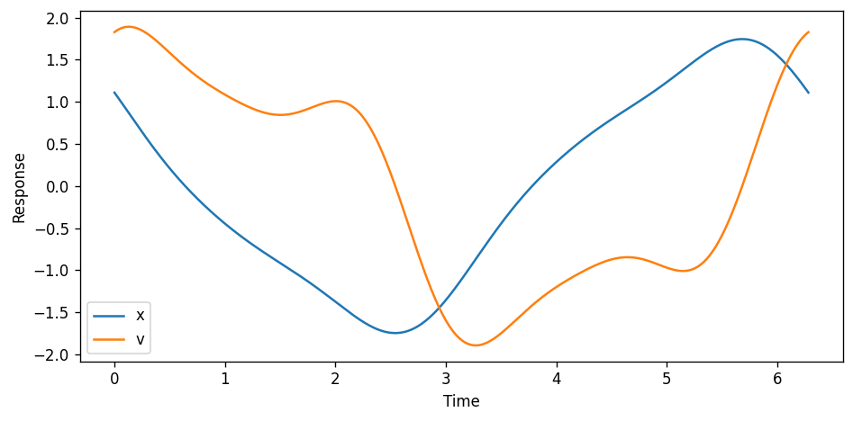

# Harmonic Balance 

This is a minimalistic framework for solving periodic steady state and limit cycles of nonlinear dynamic systems using the harmonic balance method.
At the core is a `Fourier` class that represents a fourier series and implements basic operators such as addition, and multiplication as well as general nonlinearities and time domain differentiation.
This enables an easy formulation of the residual function of the nonlinear dynamics problem.

There are a lot of common examples for nonlinear dynamical systems in the `examples` directory.

## The Fourier Class

The heart of this minimalistic framework is the `Fourier` class in `harmonicbalance.fourier`. The class implements the common arithmetic operations such as `__add__`, `__sub__`, `__mul__`, etc. The operations are implemented in such a way that they transform the time domain signal that is represented by a set of fourier coefficiencts. For arbitrary nonlinear operations such as `__pow__`, etc. the signal is constructed in the time domain from the fourier coefficients using numpys efficient `ifft`. 

In short, all the mess of harmonic balance residual function setup and transfer between frequency- and time-domain is naturally handled by the fourier objects.

The fourier coefficients are internally present in the real valued configuration with DC, cos and sin components. Like this:

```python
coeffs = [coeff_dc, *coeffs_cos, *coeffs_sin]
```


This allows the use of the powerfull optimizers from the `scipy.optim` library.

## Example Duffing Oscillator
For example, lets solve the steady state of the driven duffing oscillator which is a basic damped oscillator with an additional cubic stiffness ($g$) term.

$$
m \ddot{x} + c \dot{x} + dx + g x^3 = p \cos(\omega_0 t)
$$

In the harmonic balance world, the residual will look like this:

$$
r(x) = m \ddot{x} + c \dot{x} + dx + g x^3 - p \cos(\omega_0 t)
$$

When $r$ is zero (or numerically close to zero) we know that $x$ satisfies the duffing ODE and therefore must be a solution. 


```python
import numpy as np
import matplotlib.pyplot as plt

#import the 'Fourier' class and the solver wrapper
from harmonicbalance.fourier import Fourier
from harmonicbalance.solvers import fouriersolve

#duffing parameters 
m, c, d, g, p = 1.0, 2.0, 0.3, 1.4, 5.0

#excitation, this is the cos term
U = Fourier(omega=1, n=5) 
U[1] = 1 #fundamental frequency cos term

#residual for duffing oscillator using the 'Fourier' class
def residual_duffing(X):
    return  m * X.dt().dt() + c * X.dt() + d * X + g * X**3 - p * U

#initial guess (just use the excitation)
X0 = U.copy()

# solve -> minimize residual, returns another 'Fourier' object
X_sol, _sol = fouriersolve(residual_duffing, X0, method="hybr")
```

    runtime of 'fouriersolve' : 8.257699984824285 ms
    


```python
#examine the 'Fourier' object
print(X_sol)
```

    Fourier(coeff_dc=4.66229072966336e-10, coeffs_cos=[ 1.08236692e+00 -1.51914927e-10  4.60358995e-02  3.88449135e-11
     -1.87784775e-02], coeffs_sin=[-1.15139578e+00  2.06593164e-10 -1.95966475e-01  3.00183167e-11
     -1.75997843e-02], omega=1, n=5)
    

The `Fourier` class also implements some methods for easy time domain evaluation, which we can use to plot the time domain response and the trajectory in the phase space.


```python
# Evaluate the solution
t = np.linspace(0, X_sol._T(), 1000)
x = X_sol.evaluate(t) 
v = X_sol.dt().evaluate(t)
```


```python
# Plot the solution (time domain)
fig, ax = plt.subplots(tight_layout=True, figsize=(8,5), dpi=120)

ax.plot(t, x, label="x")
ax.plot(t, v, label="v")

ax.legend()
ax.set_xlabel("Time")
ax.set_ylabel("Response");
```


    

    


```python
# Plot the solution (phase diagram)
fig, ax = plt.subplots(tight_layout=True, figsize=(8,5), dpi=120)

ax.plot(x, v)

ax.set_xlabel("x")
ax.set_ylabel("v");
```


    

    


## Example Predictor-Corrector Solver

The duffing oscillator is known for its bifurcation, which means that there exist multiple solutions for the same set of parameters. Typically these solutions are hard to find numerically by conventional methods (for example numerical integration). The harmonic balance method can be used to obtain these solutions by continuing the solution curve for a given parameter variation (in this case the excitation frequency $\omega_0$). This results in the well known backbone curve.

This package also implements a simple `PredictorCorrector` solver that uses the secant method for the predictor step and corrects the solution using the harmonic balance method with an additional constraint (arclength / hypersphere).


```python
from harmonicbalance.predictorcorrector import PredictorCorrectorSolver

#duffing parameters
m, c, d, g, p = 1, 0.2, 1, 2, 3

#excitation, this is the cos term
U = Fourier(omega=1, n=5) 
U[1] = 1 #fundamental frequency cos term

#residual for duffing oscillator
def residual_duffing(X):
    return m * X.dt().dt() + c * X.dt() + d * X + g * X**3 - p * U

#initial guess (just use the excitation)
X0 = U.copy()

#initialize the predictor-corrector solver
PCS = PredictorCorrectorSolver(residual_duffing, 
                               X0, 
                               alpha_start=X0.omega, 
                               alpha_end=5, 
                               alpha_step=0.1, 
                               method="hybr")

#find solutions in specified range
solutions = PCS.solve()
```

    runtime of 'fouriersolve' : 4.071000003023073 ms
    runtime of 'fouriersolve_arclength' : 6.971499999053776 ms
    runtime of 'fouriersolve_arclength' : 2.7922000153921545 ms
    runtime of 'fouriersolve_arclength' : 3.6125999758951366 ms
    runtime of 'fouriersolve_arclength' : 2.9405000095721334 ms
    ...
    runtime of 'fouriersolve_arclength' : 2.671800000825897 ms
    runtime of 'fouriersolve_arclength' : 2.7083000168204308 ms
    runtime of 'fouriersolve_arclength' : 2.909000002546236 ms
    runtime of 'fouriersolve_arclength' : 2.6077000075019896 ms
    runtime of 'fouriersolve_arclength' : 2.793399995425716 ms
    runtime of 'solve' : 670.6766000133939 ms
    


```python
#find specific solutions at a given frequency from backbone curve
specific_omega = 3
specific_solutions = PCS.solve_specific(specific_omega)
```

    runtime of 'fouriersolve' : 4.574399994453415 ms
    runtime of 'fouriersolve' : 2.503299998352304 ms
    runtime of 'fouriersolve' : 2.2751000069547445 ms
    runtime of 'solve_specific' : 9.798999992199242 ms
    


```python
#plot the solution (phase diagram)
fig, ax = plt.subplots(tight_layout=True, figsize=(8,5), dpi=120)

#solution curve
ax.plot([s.omega for s in PCS.solutions], [s.amplitude() for s in solutions], ".-")

#specific solutions
ax.axvline(specific_omega, color="k")
for s in specific_solutions:
    ax.plot(s.omega, s.amplitude(), "o", color="tab:red")

ax.set_xlabel("Omega")
ax.set_ylabel("Amplitude");
```


    

    


